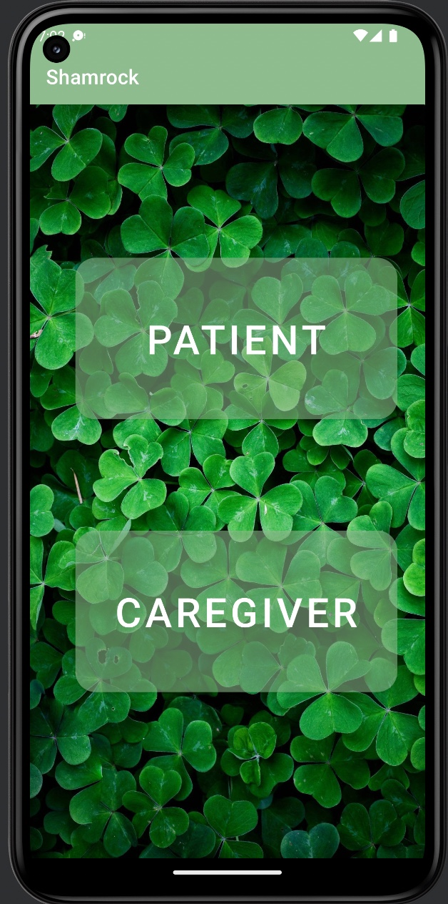
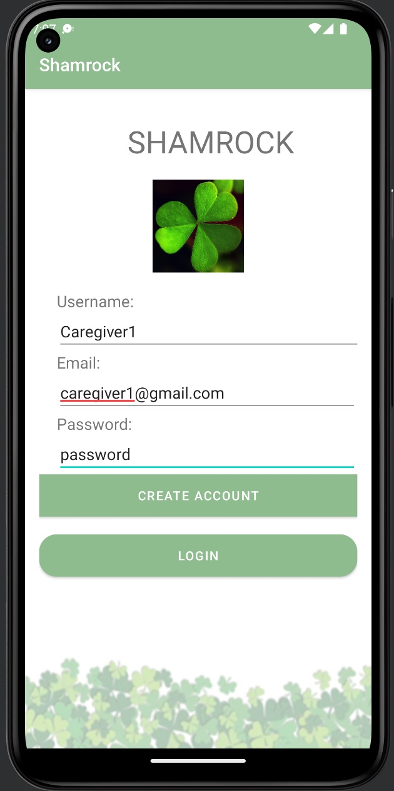
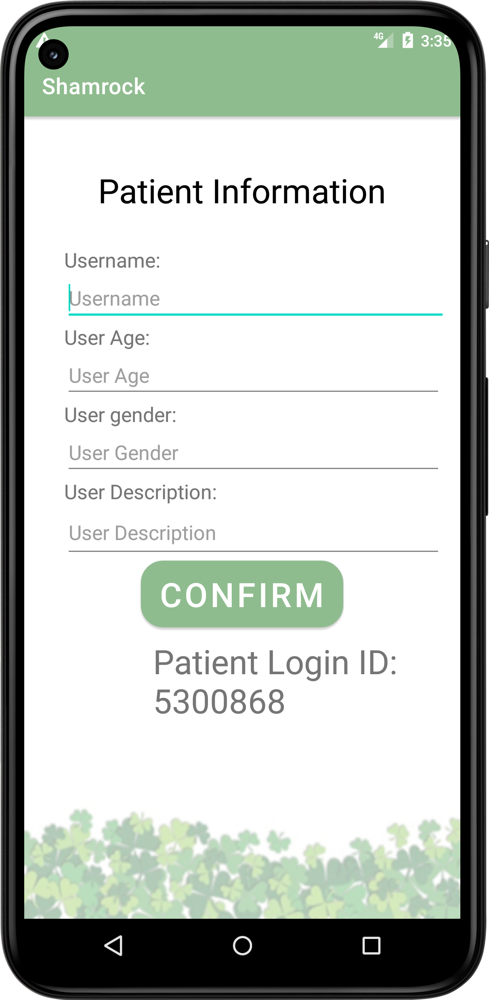
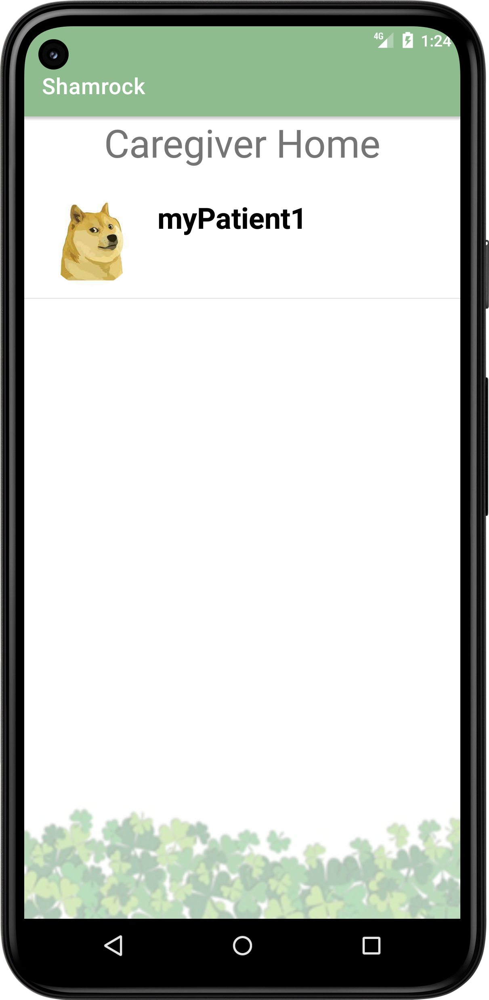
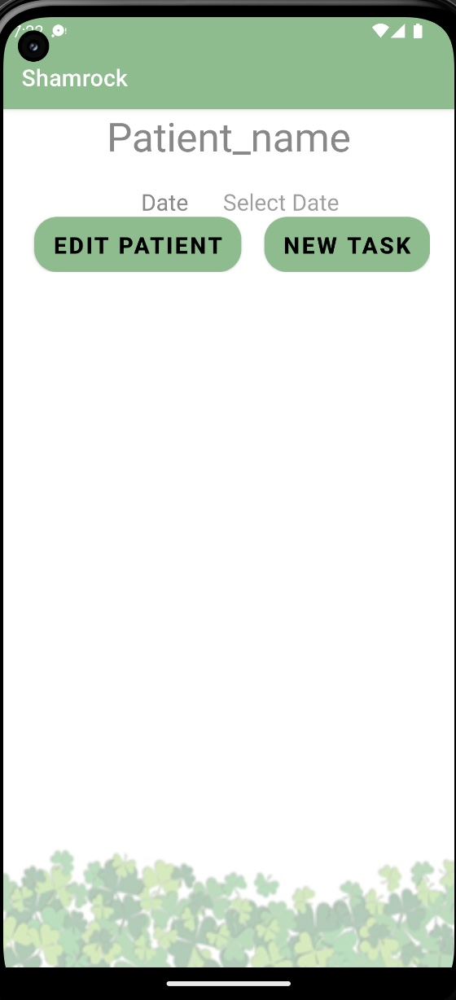
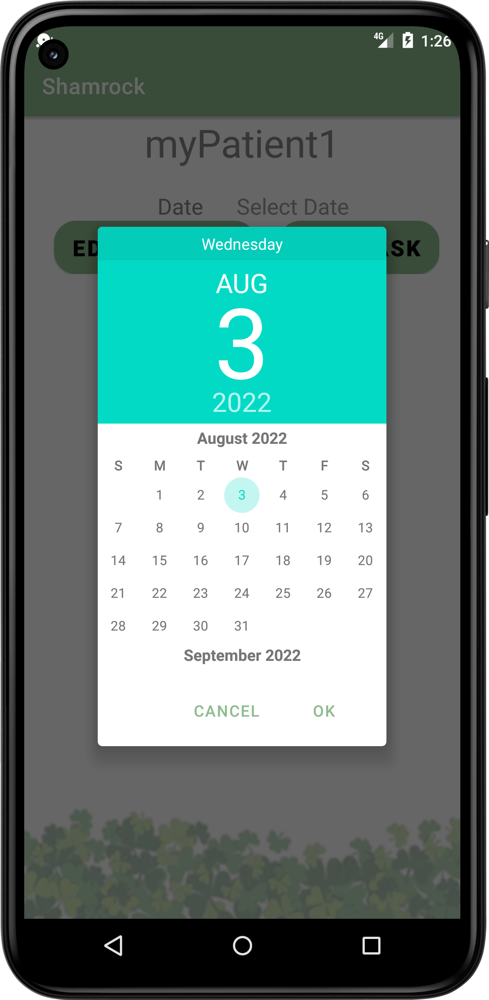
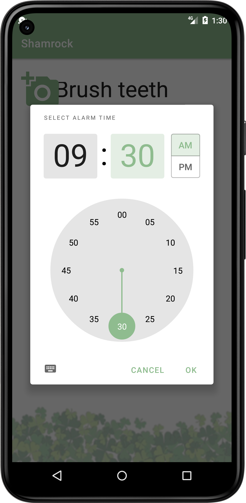
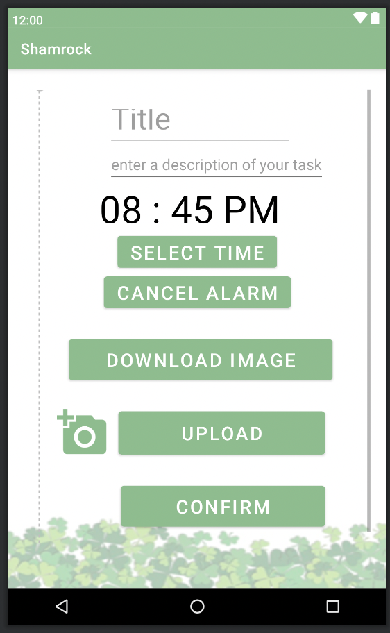
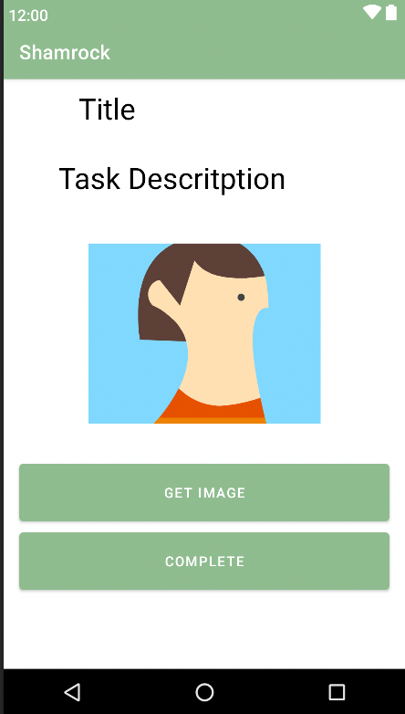
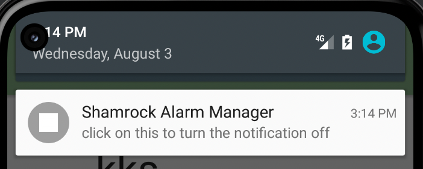

# Shamrock
 
## Description
This application will have two target users, mainly the patients suffering from dementia and their caregivers.
Shamrock enables the caregivers to set specific schedules and tasks for their patients. Shamrock allows caregivers to manage their dementia patients in an effective and efficient manner. Another unique feature of this application is it gives caregivers the ability to verify if a certain task has been done by the patient or not.
Shamrock reminds patients of tasks, which help them keep up with their daily schedule. This application is easy to use and interactive which grabs the interest of the user and helps them perform their day-to-day task with ease. As Shamrock keeps the dementia patients busy and involved in different interactive tasks it may help them prevent hallucinations by keeping them occupied. This application is very beneficial for dementia patients as it encourages them to partake in various mental exercises by making them perform tasks in a timely manner. Keeping a regular routine can alleviate the stress of dementia as the disease progresses. Shamrock instills independence which encourages the PWD to feel good and productive about themselves.
 
# Different files in our code and what is their significance…
 
 | File Name | Description |
| ------ | ------ |
| MainActivity | Let the user choose Patient or Caregiver |
| MainActivity2 | The caregiver can create an account or log in with their existing account |
| MainActivity3 | The homepage for the caregiver |
| MainActivity4 | The page for editing patient tasks |
| MainActivity5 | This file has all the features for a working alarm for the application |
| MainActivity6 | Let the caregiver add their patient |
| MainActivity7 | Login page for patient |
| MainActivity8 | Let caregiver update patient information |
| MainActivity9 | Caregiver can upload the image |
| MainActivity10 | The page to notify the task information |
| patient_homepage | The homepage for the patient |
| Patient | This class provides methods for storing information regarding the patient in the database |
| Caregiver | This class provides methods for storing information regarding the caregiver |
| Task | This is a class that helps to store alarms in the database |
| pTask | This is a class that helps to store alarms in the database |
| Schedule | This is the class for storing the date of the schedule |
| AlarmReceiver| This file is used to show the pop-up notification to the user |
| DestinationActivity | This basically a separate page that opens after the alarm is stopped |
| BufferCaregiver| This page is a buffer page while the app reads the data from the database |
| BufferPatientHome | This page is a buffer page while the app reads the data from the database  |

 **Rest of the java files which are not mentioned in the above table are for future use. 
 
 
 
## Steps to Run our application
 
**Step 1:** Clone Repo 
**Step 2:** Open in Android Studio, build and view in emulator Ensure that your emulator has at least 
<ul>
   <li>Target API level 19 (Kitkat) or higher</li>
   <li>Uses Android 4.0 or higher</li>
</ul>
 
Personally, our emulator is
<ul>
   <li>Pixel 5</li>
   <li>API Level 22 Lollipop</li>
   <li>Android 5.1</li>
</ul>
However, the default emulator works fine as well
 
<h1>Application Features </h1>
<ul>
   <li>Can read and write to Firestore Cloud</li>
   <li>Can Switch pages</li>
   <li>Basic methods of Caregiver, Patient, Task, and Schedule class needed for the database have been implemented </li>
   <li>Allows the user to choose their role either caregiver and patient </li>
   <li>Allows the caregiver to create an account and login </li>
   <li>Checks if the caregiver enters a well-formatted email address </li>
   <li>Checks that the caregiver enters a 6 digit/symbol/alphabet/character password </li>
   <li>Checks if that particular account already exist or not </li>
   <li>Allows the caregiver to login in an already created account </li>
   <li>If the caregiver account is new then the app allows to add new patient information </li>
   <li>For patient information it takes in Name, Age, Sex, Description </li>
   <li>Allows the caregiver to scroll through the patient list </li>
   <li>Allows the caregiver to edit patient information </li>
   <li>Allows to select the date for the schedule </li>
   <li>Let the caregiver to add new task</li>
   <li>Allows caregiver to upload the images</li>
   <li>Task can take in its title, description, time, and images</li>
   <li>Notifies the user when the alarm rings </li>
   <li>Allows the caregiver to set and cancel the alarm </li>
   <li>Lists the tasks that caregivers have scheduled for their patients</li>
   <li>Caregiver can scroll through the list to see all the tasks</li>
   <li>Patient can login by entering their 7-digit ID</li>
   <li>Checks if the patient login ID match with the ID on the databse</li>
   <li> Patients can scroll through to see their tasks in patient homepage</li>

</ul>
 

<h1> Procedure</h1>
 Below are screenshots of each page and what their features are
 Some of the Pages may be slow when loading
<h4> Choosing User Type Page</h4> 

 
 
 
 
 
 
<ul>
<li>     The [Patient] button will take the user to the patient interface of the application</li>
<li></li>
<li>	The [Caregiver] button will take the user to the caregiver interface of the application </li>
</ul>
 
 
 
 
 
 
 
 
 
 
 
 
 
 
 
<h4>Caregiver Login Page</h4>

 
 
 
 
 
 
 

<ul>
<li>	To create an account email must be unique, the username does not have to match</li>
<li>	When logging in the Caregiver's email and password must be correct</li>
<li></li>
<li>The account displayed is fake, you must create your own account to test the application</li>
<li></li>
<li>	The [Create Account] will lead the caregiver user to create a patient</li>
<li></li>
<li>	The [Log In] button will lead the user to the Caregiver home page </li>
</ul>
 
 
 
 
 
 
 
 
 
 
<h4>Creating Patient</h4>

 
 
 
 
 
 
 
 
Add information about the patient 
Adding User Description is optional 
 
The [CONFIRM] button adds the patient information to the database and leads the caregiver to the Caregiver Homepage 
 
The caregiver has to manually press the back button on the device to go back to the home page
 
 
 
 
 
 
 
 
 
 
 
 
<h4>Caregiver Homepage</h4>

 
 
 
 
 
 
 
 
 
Click and Drag to scroll the list of patients 
 
Click on any patient to be led to editing the Schedule of that particular patient 
 
 
 
 
 
 
 
 
 
 
 
 
 
<h4>Edit Patient’s Schedule Page</h4>

 
 
 
 
 
 
 
 
 
Must select Date before entering a New Task, otherwise, the system will prompt you to select a date 
The [Select Date] field allows selecting date 
 
The [Edit Patient] button allows to edit patient information, it will lead to the same page as ‘Creating Patient’ 
 
The [New Task] button allows for creating a new task for a patient like an alarm 
 
 
 
 
 
 
 
 
 
 
 
<h4>Calendar</h4>

 
 
 
 
 
 
 
Should be able to choose any date and exit without setting a date as well 
 
 
 
 
 
 
 
 
 
 
 
 
 
 
 
 
 
 
 
 
 
 
<h4>Selecting Time</h4>

 
 
 
 
 
 
 
 
  The user can set the time using the dial 
 
 
 
 
 
 
 
 
 
 
 
 
 
 
 
 
<h4>Add Title and Description</h4>

 
 
 
 
 
 
 
 
 
The [Title] allows the caregiver to set title for the task that is being set up for the patient. 
 
The [Description] allows the caregiver to put in the description for the particular task, as it will tell the patient that what is expected to be done for that task. 
 
 
 
 
 
 
 
 
 
 
 
 
 
 
<h4>Download Image</h4>

 
 
 
 
 
 
 
 
 
 
The [DOWNLOAD IMAGE] button allows the caregiver to download the image from the internet. When the user clicks onthis button it directly leads the user to google images page from where various images ca be downloaded in the gallery of the phone. 
 
 
 
 
 
 
 
 
 
 
 
 
 
 
<h4>UPLOAD Image</h4>

 
 
 
 
 
 
 
 
 
 
The camera icon allows the image to choose the image from the gallery that the user wants to upload.
The [UPLOAD IMAGE] button allows the caregiver to upload the image from the gallery to the database. 
 
 
 
 
 
 
 
 
 
 
 
 
 
 
<h4>Confirm</h4>

 
 
 
 
 
 
 
 
 
 
The [CONFIRM] button allows the caregiver to make sure that he or she has added all the required information for the task and save all the information to the database. 
 
 
 
 
 
 
 
 
 
 
 
 
 
 
<h4>Show Image</h4>

 
 
 
 
 
 
 
 
 
 
The [GET IMAGE] button allows the patient to see the image that was uploaded to by the caregiver related to a particular task. 
 
 
 
 
 
 
 
 
 
 
 
 
 
 
 
<h4>Notification</h4>

 
 
A notification pops up on the screen when the alarm rings, once the user clicks on the notification it stops the alarm and takes the user to the patient login where they log in with a unique id and see the list of tasks. 
 
 
 
 
 
 
 
 
 
 
 

 
 
 

